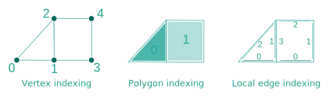
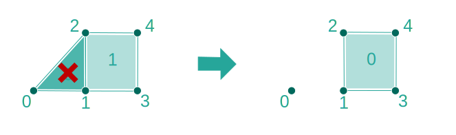
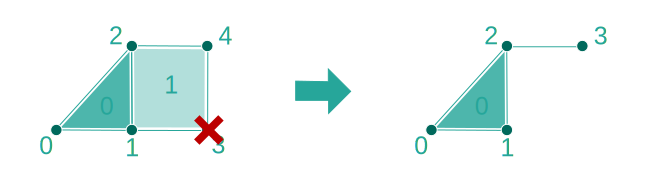
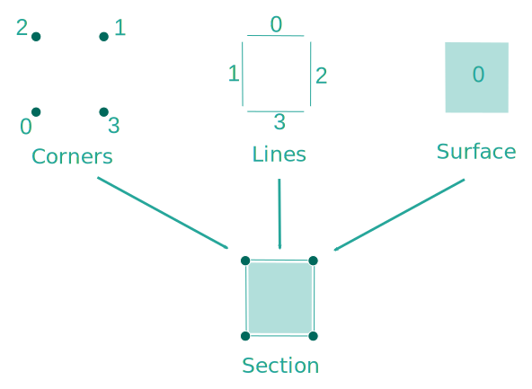

<script setup>
import CodeExample from '/components/CodeExample.vue'
</script>


# Builders
<!-- @include: ./links.md -->
In this guide, you will learn fundamental elements to build and modify a mesh and a model in OpenGeode.

## What are Builders ?

As you may have noticed, OpenGeode Meshes and Models are read-only classes. You cannot modify them directly.

The goal of this design is to:

1. clearly identify what operations will affect the class storage,

2. give access to modifying methods on a shorter lifetime.

Every Mesh or Model has its own corresponding Builder, for example:

- [`VertexSetBuilder`] is the builder for [`VertexSet`]

 - [`TriangulatedSurfaceBuilder`] is the builder for TriangulatedSurface

- [`BRepBuilder`] is the builder for BRep

The builders inheritance diagram is the same as the one for the corresponding meshes and models. Like them, builders can be templated by their dimension. For example, two aliases are defined for [`TriangulatedSurfaceBuilder`] : **TriangulatedSurfaceBuilder2D** and **TriangulatedSurfaceBuilder3D**.

## Create a Builder
First of all, let's create the builder for its corresponding object :

<CodeExample>
<template v-slot:cpp>

```cpp
// Let's have a TriangulatedSurface3D& called mesh
auto mesh_builder = TriangulatedSurfaceBuilder3D::create( mesh );
...
// Let's have a BRep& called brep
BRepBuilder brep_builder( brep );
```
</template>
<template v-slot:py>

```py
## Let's have a TriangulatedSurface3D& called mesh
mesh_builder = opengeode.TriangulatedSurfaceBuilder3D.create( mesh )
...
## Let's have a BRep& called brep
brep_builder = opengeode.BRepBuilder( brep )
```
  </template>
</CodeExample> 


Using the static function `Builder::create()` will automatically identify the builder matching the object to modify it accordingly. So if you only need the inherited builder interface, you can do :

<CodeExample>
<template v-slot:cpp>

```cpp
// Let's have a TriangulatedSurface3D& called mesh
auto mesh_builder = SurfaceMeshBuilder3D::create( mesh );
```
</template>
<template v-slot:py>

```py
## Let's have a TriangulatedSurface3D& called mesh
mesh_builder = opengeode.SurfaceMeshBuilder3D.create( mesh )
```
  </template>
</CodeExample> 

## Mesh builders

We will use a simple [`PolygonalSurface`] (shown in the image below) and its builder and see what we can do.



There are 3 main types of operations on a surface:
- create, modify or delete a point which is a vertex with coordinates
- create, modify or delete a polygon (or a triangle)
- create, modify or delete adjacency between polygons

Let's start with an example of mesh creation.

<CodeExample>
<template v-slot:cpp>

```cpp
auto mesh = PolygonalSurface2D::create();
auto mesh_builder = PolygonalSurfaceBuilder2D::create( *mesh );

// Create some points
const auto pt0 = mesh_builder->create_point( { {0., 0.} } );
const auto pt1 = mesh_builder->create_point( { {1., 0.} } );
const auto pt2 = mesh_builder->create_point( { {1., 1.} } );
const auto pt3 = mesh_builder->create_point( { {2., 0.} } );
const auto pt4 = mesh_builder->create_point( { {2., 1.} } );

// Create some polygons
const auto poly0 = mesh_builder->create_polygon( {0, 1, 2} ); // a triangle
const auto poly1 = mesh_builder->create_polygon( {1, 3, 4, 2} ); // a quad

// Connect these polygons programmatically
mesh_builder->set_polygon_adjacent( {poly0, 1}, poly1 ); // {poly0, 1} is the PolygonEdge to connect
mesh_builder->set_polygon_adjacent( {poly1, 3}, poly0 ); // {poly1, 3} is the PolygonEdge to connect
// or automatically
mesh_builder->compute_polygon_adjacencies();
```
</template>
<template v-slot:py>

```py
mesh = opengeode.PolygonalSurface2D.create()
mesh_builder = opengeode.PolygonalSurfaceBuilder2D.create( mesh )

## Create some points
pt0 = mesh_builder.create_point( opengeode.Point2D( [0., 0.] ) )
pt1 = mesh_builder.create_point( opengeode.Point2D( [1., 0.] ) )
pt2 = mesh_builder.create_point( opengeode.Point2D( [1., 1.] ) )
pt3 = mesh_builder.create_point( opengeode.Point2D( [2., 0.] ) )
pt4 = mesh_builder.create_point( opengeode.Point2D( [2., 1.] ) )

## Create some polygons
poly0 = mesh_builder.create_polygon( [0, 1, 2] ) ## a triangle
poly1 = mesh_builder.create_polygon( [1, 3, 4, 2] ) ## a quad

## Connect these polygons programmatically
mesh_builder.set_polygon_adjacent( opengeode.PolygonEdge(poly0, 1), poly1 ) ## {poly0, 1} is the PolygonEdge to connect
mesh_builder.set_polygon_adjacent( opengeode.PolygonEdge(poly1, 3), poly0 ) ## {poly1, 3} is the PolygonEdge to connect
## or automatically
mesh_builder.compute_polygon_adjacencies()
```
  </template>
</CodeExample> 


And now, two examples of deletion. For every element, you have to give which ones to keep and which ones to remove.

Deleting the polygon #0 will remove the polygon and renumber the remaining polygons.

<CodeExample>
<template v-slot:cpp>

```cpp
mesh_builder->delete_polygons( {true, false} ); // Only the first polygon is removed
```
</template>
<template v-slot:py>

```py
mesh_builder.delete_polygons( [true, false] ) ## Only the first polygon is removed
```
  </template>
</CodeExample> 




Deleting the vertex #3 will remove the vertex, renumber the remaining vertices and remove the polygons containing this vertex.

<CodeExample>
<template v-slot:cpp>

```cpp
mesh_builder->delete_vertices( {false, false, false, true, false} ); // Only the fourth vertex is removed

// To remove several vertices at once
mesh_builder->delete_vertices( {false, true, false, true, false} ); // The second and fourth vertices are removed
```
</template>
<template v-slot:py>

```py
mesh_builder.delete_vertices( [false, false, false, true, false] ) ## Only the fourth vertex is removed

## To remove several vertices at once
mesh_builder.delete_vertices( [false, true, false, true, false] ) ## The second and fourth vertices are removed
```
  </template>
</CodeExample> 



>Note: Deletion methods can change the indices of your entire mesh to keep continuous indexing. To know how the indexing was changed, all deletion methods return a table containing the mapping between the old index and the new index.

Equivalent methods can be found for all other mesh builders.

## Model Builders

To build a model, you need to interact with three concepts:
- add or remove a Component to the model
- add or remove a relation between two model Components
- add or remove information in the [`VertexIdentifier`]

## Create the Components and their relations

There are predefined relations between Component types. We will use the following Section as example and build the following [`section`] :



<CodeExample>
<template v-slot:cpp>

```cpp
Section section;
SectionBuilder builder( section );
```
</template>
<template v-slot:py>

```py
section = opengeode.Section()
builder = opengeode.SectionBuilder( section )
```
  </template>
</CodeExample> 

Create the components

<CodeExample>
<template v-slot:cpp>

```cpp
const auto& corner0_id = builder.add_corner(); // Add a new corner and get its unique identifier
const auto& corner0 = section.corner( corner0_id ); // Get the actual corner in the section
...
const auto& line0_id = builder.add_line();
const auto& line0 = section.line( line0_id );
...
const auto& surface0_id = builder.add_surface();
const auto& surface0 = section.surface( surface0_id );
```
</template>
<template v-slot:py>

```py
corner0_id = builder.add_corner() ## Add a new corner and get its unique identifier
corner0 = section.corner( corner0_id ) ## Get the actual corner in the section
...
line0_id = builder.add_line()
line0 = section.line( line0_id )
...
surface0_id = builder.add_surface()
surface0 = section.surface( surface0_id )
```
  </template>
</CodeExample> 

Create the relations

<CodeExample>
<template v-slot:cpp>

```cpp
builder.add_corner_line_boundary_relationship( corner0, line3 );
builder.add_corner_line_boundary_relationship( corner0, line1 );
builder.add_corner_line_boundary_relationship( corner1, line0 );
builder.add_corner_line_boundary_relationship( corner1, line2 );
...
builder.add_line_surface_boundary_relationship( line0, surface0 );
builder.add_line_surface_boundary_relationship( line1, surface0 );
builder.add_line_surface_boundary_relationship( line2, surface0 );
builder.add_line_surface_boundary_relationship( line3, surface0 );
```
</template>
<template v-slot:py>

```py
builder.add_corner_line_boundary_relationship( corner0, line3 )
builder.add_corner_line_boundary_relationship( corner0, line1 )
builder.add_corner_line_boundary_relationship( corner1, line0 )
builder.add_corner_line_boundary_relationship( corner1, line2 )
...
builder.add_line_surface_boundary_relationship( line0, surface0 )
builder.add_line_surface_boundary_relationship( line1, surface0 )
builder.add_line_surface_boundary_relationship( line2, surface0 )
builder.add_line_surface_boundary_relationship( line3, surface0 )
```
  </template>
</CodeExample> 


## Complete the unique vertex identification

This unique identification is more complex to fill. You need to identify all the mesh component vertices that represent the same point in the model.

Let's focus only on the unique vertex corresponding to the **corner0** in the picture. Then this vertex is representing the corner0, one vertex of line1 (assuming vertex #0) and line3 (assuming vertex #1) and one vertex (assuming vertex #3) of surface0.

<CodeExample>
<template v-slot:cpp>

```cpp
const auto vertex_id = builder.create_unique_vertex();
builder.set_unique_vertex( {corner0.component_id(), 0}, vertex_id ); // Link the vertex #0 of corner0 to vertex_id
builder.set_unique_vertex( {line1.component_id(), 0}, vertex_id ); // Link the vertex #0 of line1 to vertex_id
builder.set_unique_vertex( {line3.component_id(), 1}, vertex_id ); // Link the vertex #1 of line3 to vertex_id
builder.set_unique_vertex( {surface0.component_id(), 3}, vertex_id ); // Link the vertex #3 of surface0 to vertex_id
```
</template>
<template v-slot:py>

```py
vertex_id = builder.create_unique_vertex()
builder.set_unique_vertex( opengeode.MeshVertex( corner0.component_id(), 0 ), vertex_id ) ## Link the vertex #0 of corner0 to vertex_id
builder.set_unique_vertex( opengeode.MeshVertex( line1.component_id(), 0 ), vertex_id ) ## Link the vertex #0 of line1 to vertex_id
builder.set_unique_vertex( opengeode.MeshVertex( line3.component_id(), 1 ), vertex_id ) ## Link the vertex #1 of line3 to vertex_id
builder.set_unique_vertex( opengeode.MeshVertex( surface0.component_id(), 3 ), vertex_id ) ## Link the vertex #3 of surface0 to vertex_id
```
  </template>
</CodeExample> 

Repeat this process for every unique vertex of the section.