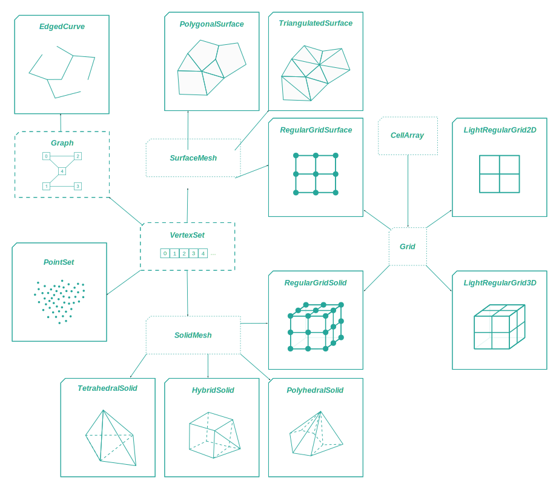
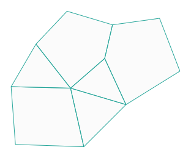
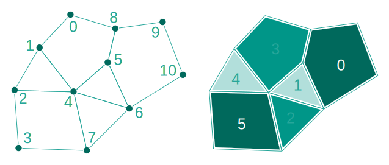
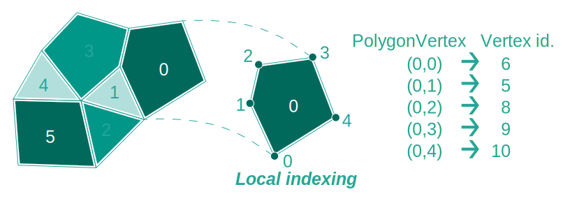
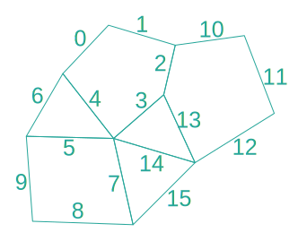
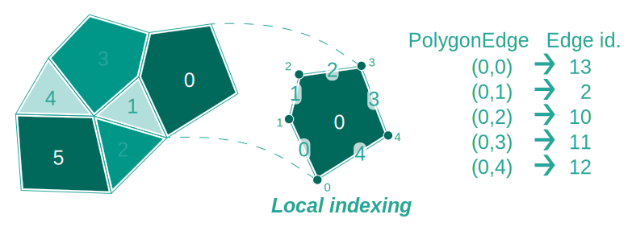
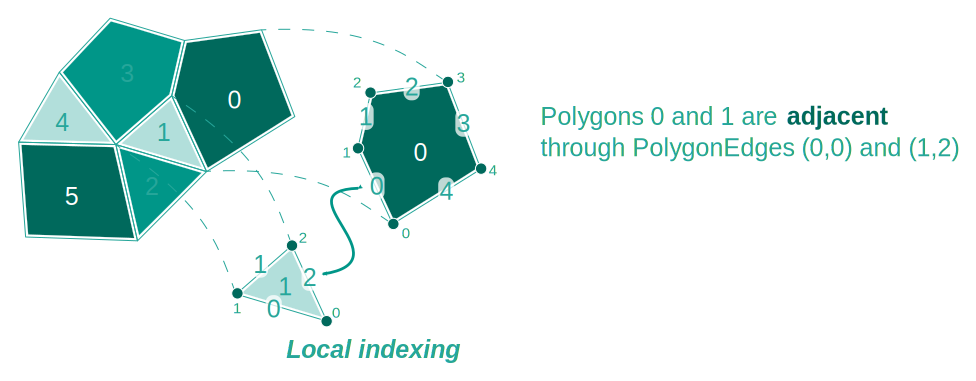
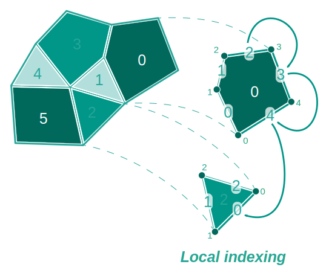
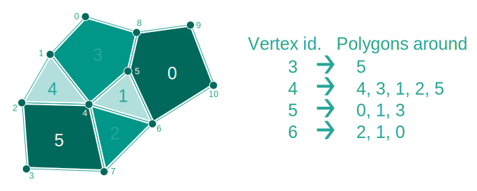
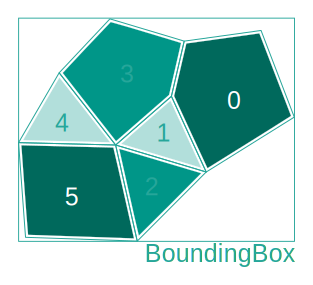

<script setup>
import CodeExample from '/components/CodeExample.vue'
</script>
<!-- @include: ./links.md -->
# Meshes

In this guide, you will learn fundamental elements to understand and manipulate meshes in OpenGeode. Let's begin by introducing every kind of mesh you can work with in OpenGeode.

## Mesh gallery

There are several kinds of meshes representing points, lines, surfaces and solids.



All these meshes are available in 2D and 3D (with the exception of solids that are by definition three-dimensional, and vertex sets and graphs which are dimensionless). The dimension is given by a template parameter. For example, two aliases are defined for [`TriangulatedSurface`]: **TriangulatedSurface2D** and **TriangulatedSurface3D**.


## Mesh definitions
We will take the example of a [`PolygonalSurface`] mesh to give some definitions on meshes and to show how to manipulate meshes. Potential differences with other kinds of meshes will be pointed if necessary.



Let's take the above polygonal mesh as the example.

## Vertices and Polygons

This [`PolygonalSurface`] is defined by 11 vertices (left) and 6 polygons (right) as shown on the image below.



Indexing of vertices is continuous, starting at `0` and ending at `number of vertices - 1`. The polygon indexing is the same.

To known the number of vertices and polygons, use the following methods :

<CodeExample>
<template v-slot:cpp>

```cpp
// Let's have a PolygonalSurface2D& called surface
const auto nbv = surface.nb_vertices();
const auto nbp = surface.nb_polygons();
...
```
</template>
<template v-slot:py>

```py
## Let's have a PolygonalSurface2D called surface
nbv = surface.nb_vertices()
nbp = surface.nb_polygons()
```
  </template>
</CodeExample> 


Polygons are defined by an ordered list of vertices. For example, the first polygon (with index 0) is defined by vertices: 6, 5, 8, 9, 10. It is easy to get the index of vertices defining a polygon using :

<CodeExample>
<template v-slot:cpp>

```cpp
// Let's have a PolygonalSurface2D& called surface;
const auto pv0 = surface.polygon_vertex( {0, 0} ); // 6
const auto pv1 = surface.polygon_vertex( {0, 1} ); // 5
const auto pv2 = surface.polygon_vertex( {0, 2} ); // 8
...
```
</template>
<template v-slot:py>

```py
## Let's have a PolygonalSurface2D called surface
pv0 = surface.polygon_vertex( opengeode.PolygonVertex([0, 0]) ) ## 6
pv1 = surface.polygon_vertex( opengeode.PolygonVertex([0, 1]) ) ## 5
pv2 = surface.polygon_vertex( opengeode.PolygonVertex([0, 2]) ) ## 8
```
  </template>
</CodeExample> 



Each of these vertices is then a [`PolygonVertex`].

>NB: For a Solid, they are called [`PolyhedronVertex`].

## Edges and Facets

Even if meshes are entirely defined by vertices and polygons, you can access the mesh facets and edges. Edges are defined for Surfaces and Solids and facets for Solids. All the methods related to edges and facets are accessible using the `surface.edges()` or `solid.facets()` getters. As for vertices and polygons, edge and facet indexings are continuous and start at 0.

>This feature is optional and disabled by default. To enable it : `surface.enable_edges();`

In the example, the polygonal surface is composed of 16 edges indexed from 0 to 15.



<CodeExample>
<template v-slot:cpp>

```cpp
// Let's have a PolygonalSurface2D& called surface;
surface.enable_edges();
const auto nbe = surface.edges().nb_edges();
const auto vertices = surface.edges().edge_vertices( 3 ); // [4, 5]
const auto edge = surface.edges().edge_from_vertices( {8, 0} ); // 1
```
</template>
<template v-slot:py>

```py
## Let's have a PolygonalSurface2D called surface
surface.enable_edges()
nbe = surface.edges().nb_edges()
vertices = surface.edges().edge_vertices( 3 ) ## [4, 5]
edge = surface.edges().edge_from_vertices( [8, 0] ) ## 1
```
  </template>
</CodeExample> 

As for vertices, it is possible to have access to the global index of a polygon edge. Each [`PolygonEdge`] is the edge that starts from the same [`PolygonVertex`]; for example, [`PolygonEdge`] (2, 1) is the edge of polygon 2 that starts from the [`PolygonVertex`] (2, 1).



>NB: For Solids, there are [`PolyhedronFacet`] and [`PolyhedronFacetEdge`].

## Topological queries

Meshes provide numerous methods to query the mesh topology. One information you can get, for example, is which polygons are adjacent to each other. More precisely, to known which polygon is adjacent to another one through a given [`PolygonEdge`], you can use the following code :

<CodeExample>
<template v-slot:cpp>

```cpp
// Let's have a PolygonalSurface2D& called surface;
const auto polygon = surface.polygon_adjacent( {0, 0} ); // 1
```
</template>
<template v-slot:py>

```py
## Let's have a PolygonalSurface2D called surface
polygon = surface.polygon_adjacent( opengeode.PolygonEdge([0, 0]) ) ## 1
```
  </template>
</CodeExample> 



You can have more information and get the index of the [`PolygonEdge`] on the adjacent polygon, using the following code :

<CodeExample>
<template v-slot:cpp>

```cpp
// Let's have a PolygonalSurface2D& called surface;
const auto polygon = surface.polygon_adjacent_edge( {0, 0} ); // {1, 2}
```
</template>
<template v-slot:py>

```py
## Let's have a PolygonalSurface2D called surface
polygon = surface.polygon_adjacent_edge( opengeode.PolygonEdge([0, 0]) ) ## {1, 2}
```
  </template>
</CodeExample> 

ajdacent 

If there is no polygon adjacent to the given [`PolygonEdge`], the results of these methods are empty optionals, and the given [`PolygonEdge`] is on a border. There is a method to known if a [`PolygonEdge`] is on a border :

<CodeExample>
<template v-slot:cpp>

```cpp
// Let's have a PolygonalSurface2D& called surface;
const auto on_border0 = surface.is_edge_on_border( {0, 0} ); // false
const auto on_border1 = surface.is_edge_on_border( {0, 2} ); // true
```
</template>
<template v-slot:py>

```py
## Let's have a PolygonalSurface2D called surface
on_border0 = surface.is_edge_on_border( opengeode.PolygonEdge([0, 0]) ) ## false
on_border1 = surface.is_edge_on_border( opengeode.PolygonEdge([0, 2]) ) ## true
```
  </template>
</CodeExample> 




You can go from one edge on a border to another one using :

<CodeExample>
<template v-slot:cpp>

```cpp
// Let's have a PolygonalSurface2D& called surface;
PolygonEdge start{0, 2};
auto next_edge = surface.next_on_border( start ); // {0, 3}
next_edge = surface.next_on_border( next_edge ); // {0, 4}
next_edge = surface.next_on_border( next_edge ); // {2, 0}
auto prev_edge = surface.previous_on_border( next_edge ); // {0, 4}
...
```
</template>
<template v-slot:py>

```py
## Let's have a PolygonalSurface2D called surface
start = opengeode.PolygonEdge([0, 2])
next_edge = surface.next_on_border( start ) ## {0, 3}
next_edge = surface.next_on_border( next_edge ) ## {0, 4}
next_edge = surface.next_on_border( next_edge ) ## {2, 0}
prev_edge = surface.previous_on_border( next_edge ) ## {0, 4}
```
  </template>
</CodeExample> 


You can notice that "next" turns in the same direction than polygon vertices, and "previous" turns therefore in the inverse direction.

An exception is raised if you give as method parameter a [`PolygonEdge`] that is not on a border.

Another topological query is to get the polygon list around a vertex:

<CodeExample>
<template v-slot:cpp>

```cpp
// Let's have a PolygonalSurface2D& called surface;
const auto polygons_around4 = surface.polygons_around( 4 ); // an inlined vector containing {4, 3, 1, 2, 5}
```
</template>
<template v-slot:py>

```py
## Let's have a PolygonalSurface2D called surface
polygons_around4 = surface.polygons_around( 4 ) ## a vector containing {4, 3, 1, 2, 5}
```
  </template>
</CodeExample> 



## Geometrical queries

Beside topological queries, you can also ask for geometrical mesh queries such as polygon area, edge length, polygon barycenter and so on.

You can get the (axis-aligned) bounding box of a mesh using:

<CodeExample>
<template v-slot:cpp>

```cpp
// Let's have a PolygonalSurface2D& called surface;
const auto bbox = surface.bounding_box();
```
</template>
<template v-slot:py>

```py
## Let's have a PolygonalSurface2D called surface
bbox = surface.bounding_box()
```
  </template>
</CodeExample> 



## Manipulating meshes

All the queries illustrated above are const mesh methods. As a consequence, you can work with a const mesh and have access to all the information you want. If you want to create or modify a mesh, however, you should use a builder as explained in the <a href ="/guides/builders.html">following guide</a>.