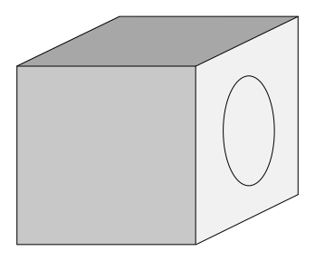
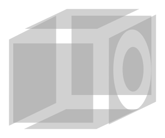
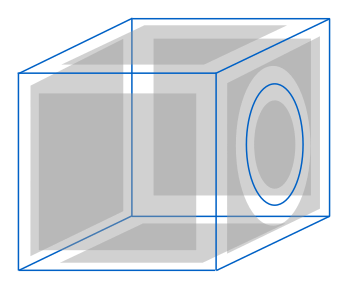
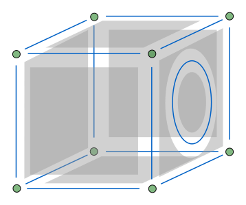
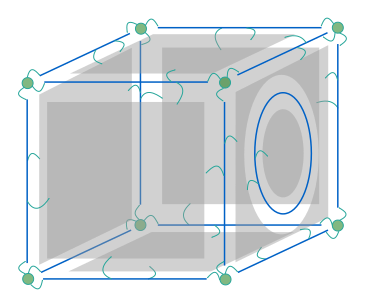
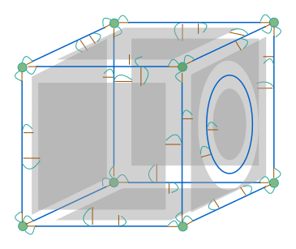
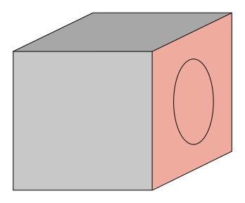
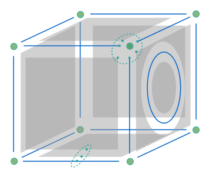

<script setup>
import CodeExample from '/components/CodeExample.vue'
</script>

# Models
<!-- @include: ./links.md -->
In this guide, you will learn fundamental elements to understand and manipulate OpenGeode data model for geometric models. One of OpenGeode central classes is [`BRep`]. Let's use this class as an example.



## Manipulate Surfaces

A [`BRep`], for Boundary Representation, represents a 3D object by its boundaries. In OpenGeode, these 3D boundaries are [`Surfaces3D`] (in gray on images). A BRep is thus composed of Surfaces: it means that the class [`BRep`] inherits from the class [`Surfaces3D`]. This allows you to know the number of Surfaces in a [`BRep`] :

<CodeExample>
<template v-slot:cpp>

```cpp
BRep my_brep;
auto nb = my_brep.nb_surfaces();
```
</template>
<template v-slot:py>

```py
my_brep = opengeode.BRep()
nb = my_brep.nb_surfaces()
```
  </template>
</CodeExample> 




To iterate on all the Surfaces of a [`BRep`] , a range on Surfaces is provided:

<CodeExample>
<template v-slot:cpp>

```cpp
BRep my_brep;
for( const auto& surface : my_brep.surfaces() )
{
  // Do something with surface (which is a Surface3D)
  auto nbv = surface.mesh().nb_vertices();
}
```
</template>
<template v-slot:py>

```py
my_brep = opengeode.BRep()
for surface in my_brep.surfaces():
    ## Do something with surface (which is a Surface3D)
    nbv = surface.mesh().nb_vertices()
```
  </template>
</CodeExample> 

Note that each surface is accessed using a constant reference as a [`Surface3D`]is neither copyable nor modifiable.

Now, you may want to process only a single [`Surface3D`]. Thankfully, it is possible to get a specific [`Surface3D`]from a [`BRep`]. A major feature of OpenGeode is that model components are not continuously numbered: they are identified by a unique index [`uuid`]. This is a fundamental design element to allow modifications of OpenGeode models. You can thus obtain a [`Surface3D`]from its [`uuid`]:


<CodeExample>
<template v-slot:cpp>

```cpp
BRep my_brep;
uuid surf_id;
const auto& surface = my_brep.surface( surf_id );
```
</template>
<template v-slot:py>

```py
my_brep = opengeode.BRep()
surf_id = opengeode.uuid()
surface = my_brep.surface( surf_id )
```
  </template>
</CodeExample> 

## What about other Components ?

We have seen that a [`BRep`] is composed of [`Surface3D`]. These Surfaces delimit volumes regionalizing an object. As a consequence, a [`BRep`] is also composed of [`Blocks3D`]. The [`BRep`] class inherits from [`Surface3D`]and [`Blocks3D`].

<CodeExample>
<template v-slot:cpp>

```cpp
class BRep : public Surfaces3D,
              public Blocks3D
{
  ...
}
```
</template>
<template v-slot:py>

```py
class BRep( Surfaces3D, Blocks3D ):
  ...
```
  </template>
</CodeExample> 

You can count the number of Blocks, iterate on Blocks, get a specific [`Blocks3D`] from its [`uuid`] as done for Surfaces.



But as Surfaces bound Blocks, [`BRep`] Surfaces are bounded by Lines (in blue), and BRep Lines are bounded by Corners (in green). These classes are named **Components**. The [`BRep`] class thus inherits from all these classes. The [`BRep`] class is defined as follows:


<CodeExample>
<template v-slot:cpp>

```cpp
class opengeode_model_api BRep : public Topology,
                                  public Corners3D,
                                  public Lines3D,
                                  public Surfaces3D,
                                  public Blocks3D,
                                  public ModelBoundaries3D,
                                  public Identifier
{
  ...
};
```
</template>
<template v-slot:py>

```py
class BRep( Corners3D, Lines3D, Surfaces3D, Blocks3D ):
  ...
```
  </template>
</CodeExample> 


## Relationships between Components
A BRep is composed of several Components and several types of Components. There are some relations between Components; for example and as mentionned above, Lines are boundaries of Surfaces (boundaries are depicted by curved blue arrows). All these relations between Components are stored in the class [`Relationships`]. [`BRep`] inherits from this class.



Methods and ranges are provided to request relationships between Components. For example, you can get the number of Lines which are boundaries of a given Surface (using its [`uuid`]):

<CodeExample>
<template v-slot:cpp>

```cpp
BRep my_brep;
uuid surf_id;
auto nb_boundary_lines = my_brep.nb_boundaries( surf_id );
```
</template>
<template v-slot:py>

```py
my_brep = opengeode.BRep()
surf_id = opengeode.uuid()
nb_boundary_lines = my_brep.nb_boundaries( surf_id )
```
  </template>
</CodeExample> 


Much like the iteration on BRep Surfaces, it is also possible to iterate on Surface boundary Lines:

<CodeExample>
<template v-slot:cpp>

```cpp
BRep my_brep;
uuid surf_id;
const auto& surface = my_brep.surface( surf_id );
for( const auto& line : my_brep.boundaries( surface ) )
{
  // do something with line (which is a Line3D)
}
```
</template>
<template v-slot:py>

```py
my_brep = opengeode.BRep()
surf_id = opengeode.uuid()
surface = my_brep.surface( surf_id )
for line in my_brep.boundaries( surface ):
  ## do something with line (which is a Line3D)
```
  </template>
</CodeExample> 


The opposite relation type of **boundary** is named **incidence** (depicted by straight brown arrows), and the same methods and ranges are available.



Another type of relations is **internal**, and its opposite relation: **embedded**. A Component A is internal to a Component B if A is included inside B. Internal is different from boundary. You can notice that Corners and Lines can be internal Components of a Surface (but only Lines can be boundaries of Surfaces). Following the same idea, Corners, Lines, and Surfaces can be internal Components of Blocks.

The number of relations of a Surface and a Line is used to define if it is closed. A Line with no boundary or only one boundary is closed (as for the round Line on the right side of the cube). A Line with two boundaries is not closed. A Line with more than two boundaries is not valid. A Surface with no boundaries is closed. A Surface with at least one boundary is not closed, regardless of the number of internal Components.

## Collections of Components
Another kind of relations between Components allows to gather Components into groups. This is the notion of **Collections**. Components gathered into collections are called **items**. For example, in the image below, the red Surfaces can be gather in a collection standing for the right side of the cube.


In the class [`BRep`], there is one type of Collections: ModelBoundaries. This collection gathers Surfaces that bind the exterior of the model.

The class [`BRep`] is defined as follows:


<CodeExample>
<template v-slot:cpp>

```cpp
class BRep : public Relationships,
             public Corners3D,
             public Lines3D,
             public Surfaces3D,
             public Blocks3D,
             public ModelBoundaries3D
{
  ...
};
```
</template>
<template v-slot:py>

```py
class BRep( Relationships, Corners3D, Lines3D, Surfaces3D, Blocks3D, ModelBoundaries3D ):
  ...
```
  </template>
</CodeExample> 

As for other relationships, you can get the number of items in a collection, iterate on its items, etc.

You may define your own Collections to identify Components by making groups of Components.

## Unique indexing of Components mesh vertices

In an OpenGeode model, each Component mesh has its own set of vertices with a continuous indexing. But several vertices from several BRep Component meshes may represent a single point in the model (groups of blue points on image). A model vertex represented by potentially several mesh vertices is called **unique vertex**.



The class [`BRep`] also inherits from the class [`VertexIdentifier`] that stores this kind of topological information between Component meshes. [`VertexIdentifier`] provides methods to request the number of unique vertices, to get all the mesh vertices from a unique vertex index, and, conversely, get the unique vertex index of a mesh vertex:

<CodeExample>
<template v-slot:cpp>

```cpp
BRep my_brep;
auto nb_unique_v = my_brep.nb_unique_vertices();
index_t unique_v_id;
const auto& mesh_vertices = my_brep.component_mesh_vertices( unique_v_id );
uuid surf_id;
for( const auto& cmv : mesh_vertices )
{
  if( cmv.component_id.id() == surf_id )
  {
    const auto vertex_in_surface = cmv.vertex;
  }  
}
```
</template>
<template v-slot:py>

```py
my_brep = opengeode.BRep()
nb_unique_v = my_brep.nb_unique_vertices()
unique_v_id = 0
mesh_vertices = my_brep.component_mesh_vertices( unique_v_id )
surf_id = opengeode.uuid()
for(cmv in mesh_vertices):
  if(cmv.component_id.id() == surf_id):
    mesh_vertices_in_surface = cmv.vertex
```
  </template>
</CodeExample> 


Notice that all Component mesh vertices are not necessarily identified by unique vertices (only a few can be identified).

To simplify inheritance and gather topological information (between Components and between Component meshes), OpenGeode provides a class named [`Topology`] inheriting from both [`Relationships`] and [`VertexIdentifier`].

Finally, the class [`BRep`] is defined as follows:

<CodeExample>
<template v-slot:cpp>

```cpp
class BRep : public Topology,
             public Corners3D,
             public Lines3D,
             public Surfaces3D,
             public Blocks3D,
             public ModelBoundaries3D
{
  ...
};
```
</template>
<template v-slot:py>

```py
class BRep( Relationships, Corners3D, Lines3D, Surfaces3D, Blocks3D, ModelBoundaries3D ):
  ...
```
  </template>
</CodeExample> 

## Creating your own models
At this point, you have learned all the information about [`BRep`] inheritance. Should you need other inheritances, OpenGeode provides other models, for example:


<CodeExample>
<template v-slot:cpp>

```cpp
class Section : public Topology,
                public Corners2D,
                public Lines2D,
                public Surfaces2D,
                public ModelBoundaries2D
{
  ...
};
```
</template>
<template v-slot:py>

```py
class Section( Topology, Corners, Lines3D, Surfaces3D, ModelBoundaries3D ):
  ...
```
  </template>
</CodeExample> 

Section is a **2**-dimensional model made of Corners, Lines, and Surfaces (as mesh Components) and ModelBoundaries (as Collections of Components).

This design based on mixins is fully flexible. As a consequence, you are able to build your own OpenGeode models following the same design. You can for example imagine a world map made of Surfaces, Lines, and Corners:

<CodeExample>
<template v-slot:cpp>

```cpp
class WorldMap : public Topology,
                 public Corners2D,
                 public Lines2D,
                 public Surfaces2D,
                 public CountryBorders,
                 public Countries,
                 public Continents
{
  ...
};
```
</template>
<template v-slot:py>

```py
class WorldMap( Topology, Corners2D, Lines2D, Surfaces2D, CountryBorders, Countries, Continents ):
  ...
```
  </template>
</CodeExample> 

## Geosciences models
OpenGeode-Geosciences provides two classes for geological models, [`StructuralModel`]  in 3D and [`CrossSection`] in 2D. They derive respectively from BRep and Section. They add Geological collections, allowing you to classify the geometrical entities (for instance Surfaces) into geological entities (for instance Faults, Horizons, ...).

<CodeExample>
<template v-slot:cpp>

```cpp
class StructuralModel : public BRep,
                        public Faults3D,
                        public Horizons3D,
                        public FaultBlocks3D,
                        public StratigraphicUnits3D
{
  ...
};
```
</template>
<template v-slot:py>

```py
class StructuralModel( BRep, Faults3D, Horizons3D, FaultBlocks3D, StratigraphicUnits3D )
  ...
```
  </template>
</CodeExample> 
